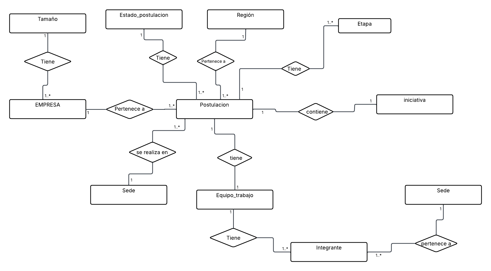
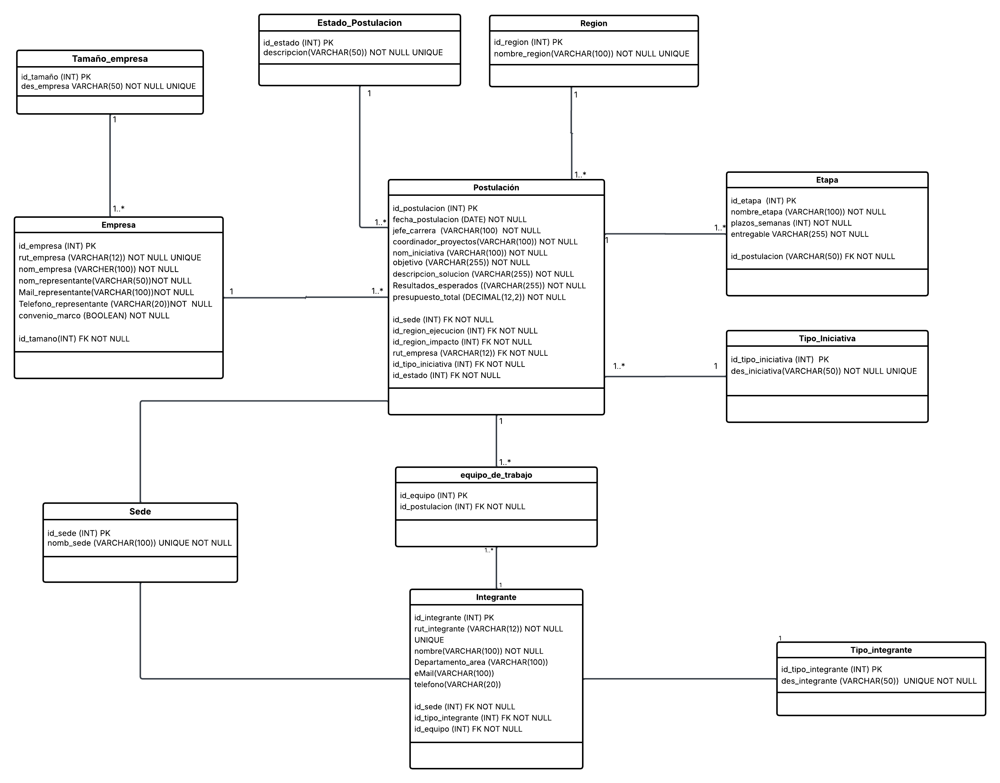

# Tarea 1 – Modelamiento de Bases de Datos y Consultas SQL

Curso **INF-239 Bases de Datos** · Universidad Técnica Federico Santa María · 2026-1

Base de datos `usm_postulaciones` en MySQL, que digitaliza el proceso de postulación de iniciativas del Centro Tecnológico de la USM (CT-USM): modelo conceptual y lógico, creación y poblamiento de tablas, y consultas SQL.

**Integrantes:** José Mena, Constanza Rios

## Estructura

```
proyecto-bdd/
├── sql/
│   ├── script.sql        # Crea la BD, tablas, claves foráneas, catálogos y datos de prueba
│   └── consultas.sql     # Las 10 consultas solicitadas
└── docs/
    ├── modelo-conceptual.png
    ├── modelo-logico-relacional.png
    └── consultas/        # Capturas del resultado de cada consulta
```

## Modelo de datos

- **Catálogos:** `region`, `sede`, `tamano_empresa`, `tipo_iniciativa`, `tipo_integrante`, `estado_postulacion`
- **Entidades principales:** `empresa`, `postulacion`, `equipo_de_trabajo`, `integrante`, `etapa`




## Cómo ejecutarlo

1. Abre `sql/script.sql` en un gestor SQL (MySQL Workbench, DBeaver, etc.) y ejecútalo completo.
2. Verifica que la base quedó creada:
   ```sql
   USE usm_postulaciones;
   ```
3. Ejecuta `sql/consultas.sql`, ya sea consulta por consulta o el archivo completo.

## Consultas

Las capturas de resultados están en [`docs/consultas/`](docs/consultas/) (consultas 1 a 9).

## Tecnologías

MySQL (InnoDB) · SQL · Modelo Entidad-Relación
